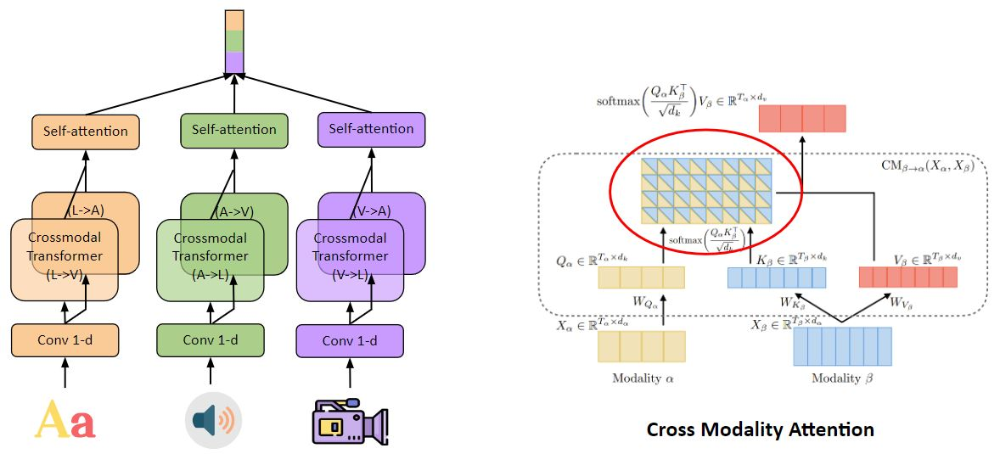
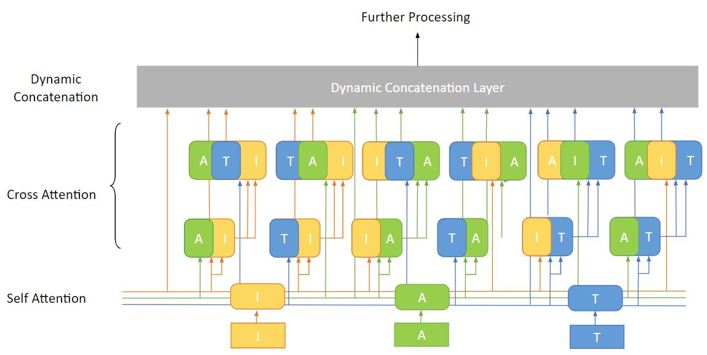

# Improving Robustness of Multimodal Learning Under Missing Modality ConditionsR
## User Guide
### Environment Requirements & Installation Instructions
Python 3.6+, Pytorch1.10+, cuda10.2+, dos2unix, timm, torchaudio, moabb

### Files
The whole framework is a dynamic modalities and fusion modules selection for training process.

- main.py: main file that conduct training and testing of the dynamic modalities & fusion modules
- EA.py: evolutionary algorithm that can select the best modality & fusion module combinations
- src/
  - data_utils.py: utilization functions for dataset processing
  - dataset.py: data loader for training 
  - dynamic_models2.py: packaging of the multimodal with dynamic modality number, fusion modules, dynamic transformer layer number, dynamic attention head and head dimension
  - eval_metrics.py: evaluation metrics
  - models2.py: parent class of dynamic_models2
  - train.py: dynamic training files
  - utils.py:
- modules/
  - dynamic_layers.py: implementation of dynamic transformer layer number
  - dynamic_multihead_attention.py: implementation of dynamic attention head and head dimension
  - dynamic_transformer.py: packaging of dynamic_layers and dynamic_multihead_attention
  - multihead_attention.py: parent class of dynamic_multihead_attention
  - position_embedding.py: position embedding module of transformers
  - transformer.py: parent class of transformer
- data_prep/
  - extract_features.py: extract features from raw video (facenet), audio (wave2vec) files for sentiment analysis tasks
  - process_data.py: split video & audio files with the provided timestamps of MOSEI 
  - std_folder.py: train, validation, test splition file providede by MOSEI
  
### Running of code
python3 main.py --dataset mosei_senti --attn_dropout 0.1 0.1 0.0 0.0 --modality_pool 2 --num_epochs 20 --lr 0.0001 --when 120 --dimension 200 --num_heads 8  --head_dim 25 --layers_single_attn 3 --layers_self_attn 2 --batch_size 16 --experiment_type test_single --data_path {preprocessed_data_path} --model_path {path_to_save_model}.pt

## Introduction
**1. What's multimodal learning**

Combining information in different formats such as video, audio, text, image, time series data to process information and make decisions for downstream tasks.

**2. Application Secenarios**

Sentiment Analysis, Robotic Arm Movement Control, object recognization, health monitoring, object localization

## Motivations & Observations

In real world applications, such as IoT applications, the sensors may not be stable and the information from these sensors will not be avaliable for a while. We conduct experiments to simulate the scenarios and find that if we train the model with full modalities and discard some of them in the inference stage, the accuracy will drop a lot. The single modality accuracy will be even lower than training this modality from scratch. Training all combinations of modalities from scratch and switch the model during inference is one possible solution. However, it requires a lot of training efforts and consumes a lot of memory for saving the models. Then a method that can have the least accuracy drop for missing modality during inference and save both training time and model size is needed.

## Related work

Multibench [1] is a benchmark work that assembles several seperatable multimodality learning datasets and sota multimodality learning algorithms. 

HighMMT [2] is proposed based on the work of Multibench and Unit [6]. It shares the same model architecture and same weights among all modalities. With the proposed method, it saves the model size while keeps a moderate loss of accuracy.

Gradient Blend, On-the-fly [3][5] explore the accuracy drop problem during inference from the perspective of back-propogation of training process. They proposes that the strong modality will dominate the learning process and disable the weaker modalities to learn. They add some regularation terms to differen modalities so that they can have equal chance to learn.

## Our Proposed Methods
Based on the obervations that the weak modalities can not learn well during the learning process and only the model related to strong modalities will be updated. We propose the random modality and fusion module selection algorithm. 

For the fusion modules we use the transformer module MULt-trans same as in [7]. 

But we 1. construct the combination of all fusion choices with MULT-trans module 2. enable the dynamic drop/add of fusion modules during training. 3. enable the dynamic drop/add of modalities during fusion process. All the dynamic mentioned above are all random. 

## Datasets

**MOSI**: http://multicomp.cs.cmu.edu/resources/cmu-mosi-dataset/

**MOSEI**: http://multicomp.cs.cmu.edu/resources/cmu-mosei-dataset/

**avMNIST**: https://github.com/pliang279/MultiBench/tree/main/datasets/avmnist

**URFUNNY**: https://github.com/ROC-HCI/UR-FUNNY

## Potential Ideas

**1. Exploring more application scenarios**: in paper [4], it considers from the dynamic in environment instead of the avaliability change of sensors. For different applications, maybe we can consider from the dynamics in computing resources constraints, user demands, network traffic, etc.

**2. Exploring theory behind random modality chosen**: The main idea of our proposed method is to make the modalities and modality fusion modules to randomly attend the learning process. Although this method has the ability to bring back the missing modality performance of inference similar to training these modalities from scratch. It is simple and not that intelligent. The next step could also be how to imrpove this random algorithm to a more intelligent one? Or explaining why the random selection works.

**3. Exploring modality help**: In MOSEI dataset, we found that the transcript modality is the strongest one for the sentiment analysis tasks. But there are correlations between video/audio and transcript. How to take full use of these correlations and help the video/audio modality learn more information and have better performance when the transcript is not avaliable during inference. The key point may exist in the design of fusion module.

## References
[1] Liang, Paul Pu, et al. "Multibench: Multiscale benchmarks for multimodal representation learning." arXiv preprint arXiv:2107.07502 (2021).

[2] Liang, Paul Pu, et al. "HighMMT: Towards Modality and Task Generalization for High-Modality Representation Learning." arXiv preprint arXiv:2203.01311 (2022).

[3] Wang, Weiyao, Du Tran, and Matt Feiszli. "What makes training multi-modal classification networks hard?." Proceedings of the IEEE/CVF Conference on Computer Vision and Pattern Recognition. 2020.

[4] Chen, Luke, Mohanad Odema, and Mohammad Abdullah Al Faruque. "Romanus: Robust Task Offloading in Modular Multi-Sensor Autonomous Driving Systems." arXiv preprint arXiv:2207.08865 (2022).

[5] Peng, Xiaokang, et al. "Balanced Multimodal Learning via On-the-fly Gradient Modulation." Proceedings of the IEEE/CVF Conference on Computer Vision and Pattern Recognition. 2022.

[6] Hu, Ronghang, and Amanpreet Singh. "Unit: Multimodal multitask learning with a unified transformer." Proceedings of the IEEE/CVF International Conference on Computer Vision. 2021.

[7] Tsai, Yao-Hung Hubert, et al. "Multimodal transformer for unaligned multimodal language sequences." Proceedings of the conference. Association for Computational Linguistics. Meeting. Vol. 2019. NIH Public Access, 2019.
